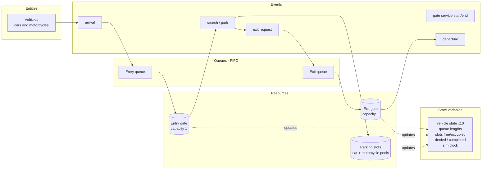
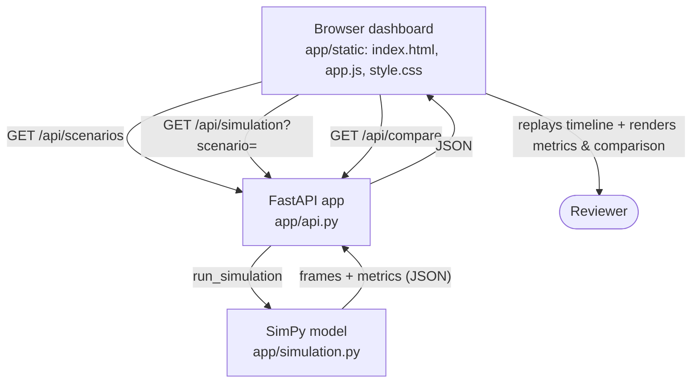

# Conceptual Model & Architecture

Two views for requirement item 4 (System Model and Design). Both render on GitHub / VS Code.

## Discrete-event conceptual model (entities · events · resources · queues · state)

## Software architecture (how it runs)

- **Backend** runs one deterministic SimPy simulation per scenario and returns a timeline of
  frames plus summary metrics.
- **`/api/compare`** returns metrics-only for all five scenarios (cached) for the comparison view.
- **Frontend** is dependency-free vanilla JS: it replays frames as an animation and renders the
  metrics, the comparison table, and the bar charts.
