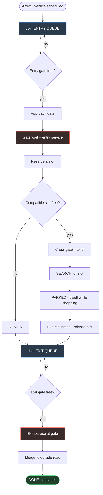

# Vehicle Lifecycle Flowchart (Process Diagram)

This is the per-vehicle process the simulation runs (requirement item 4). It renders on
GitHub and in VS Code's Markdown preview — screenshot it for the slides.

**Mapping to the 10 vehicle states:** `scheduled` (A) → `entry_queue` (B) →
`approaching_gate` (D) → `gate_wait` (E) → `gate_crossing` (H) → `searching` (I) →
`parked` (J) → `exit_queue` (L) → `exiting` (N/O) → `done` (P), with the `denied` branch (DEN).

**Resources held:** the **entry gate** is held from D through H; the **exit gate** from N through O;
a **parking slot** from F (reserve) until K (release).
